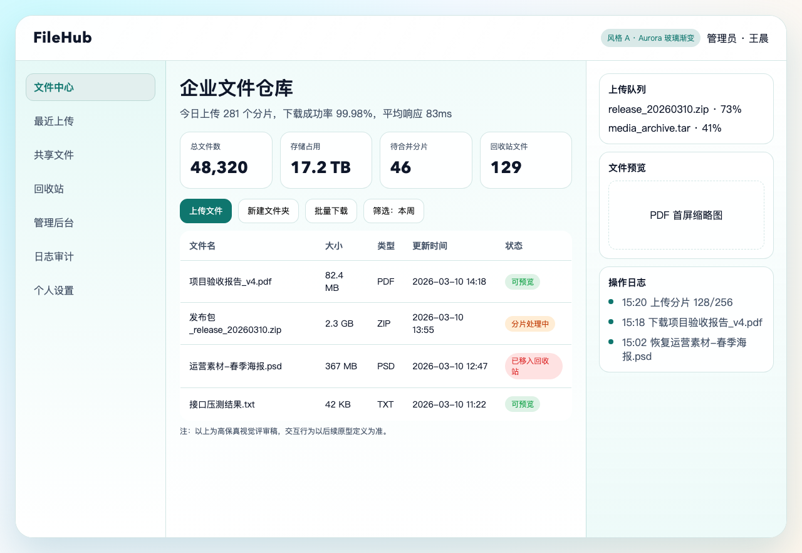
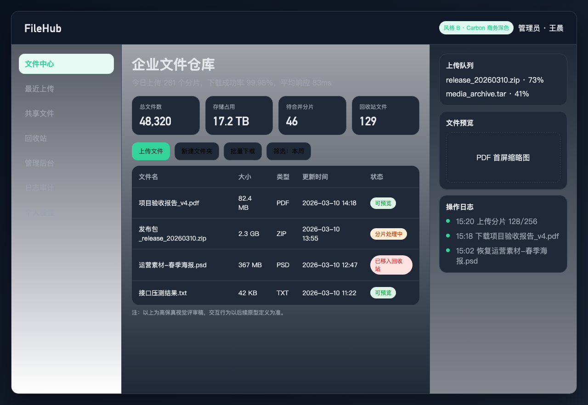
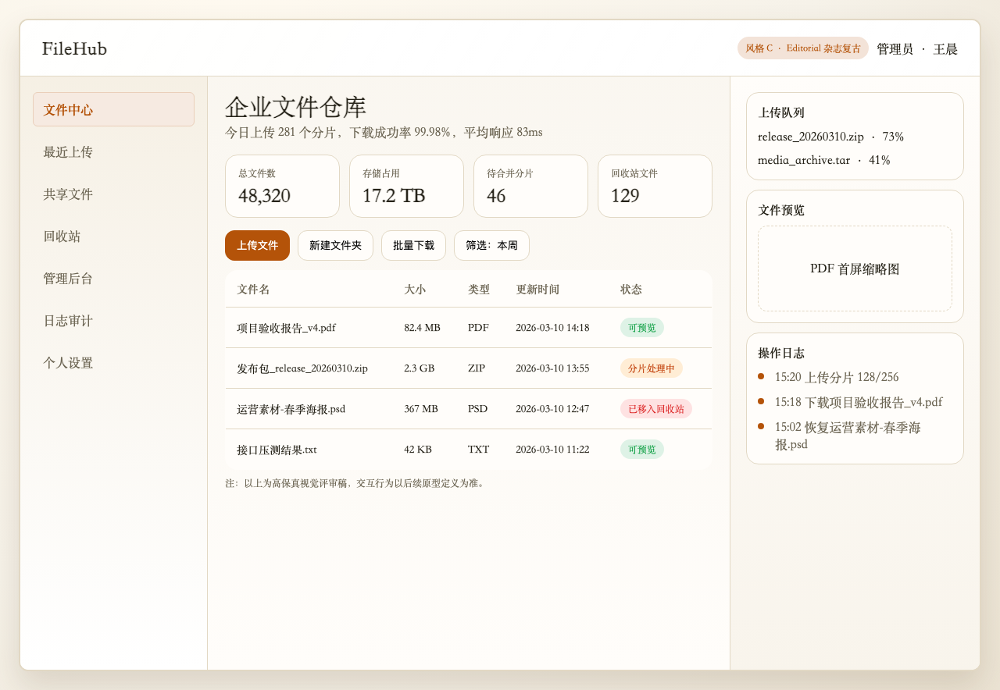
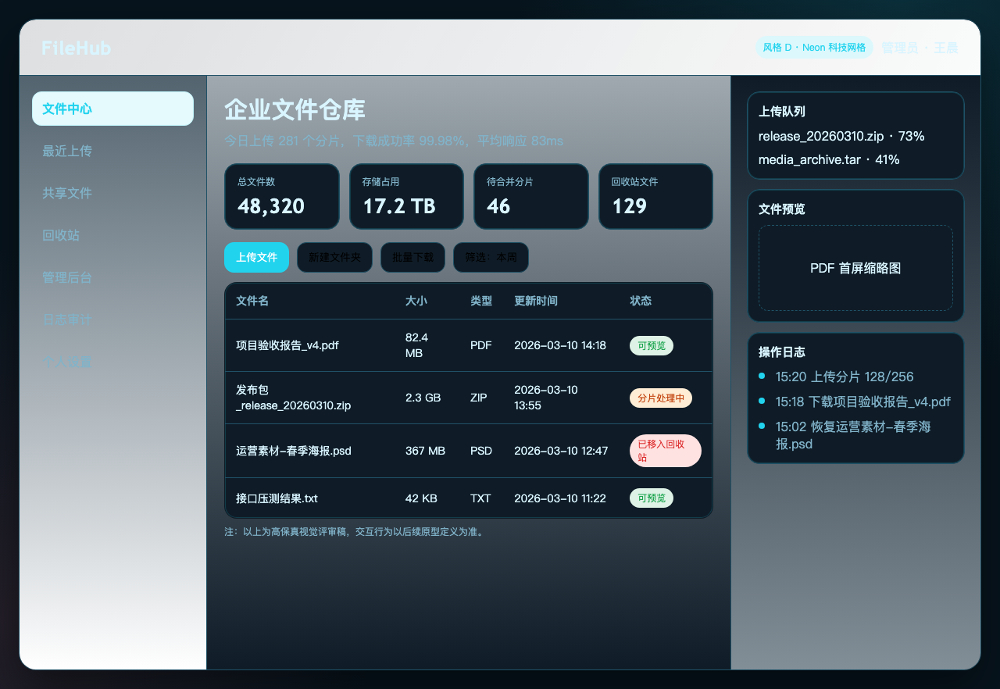
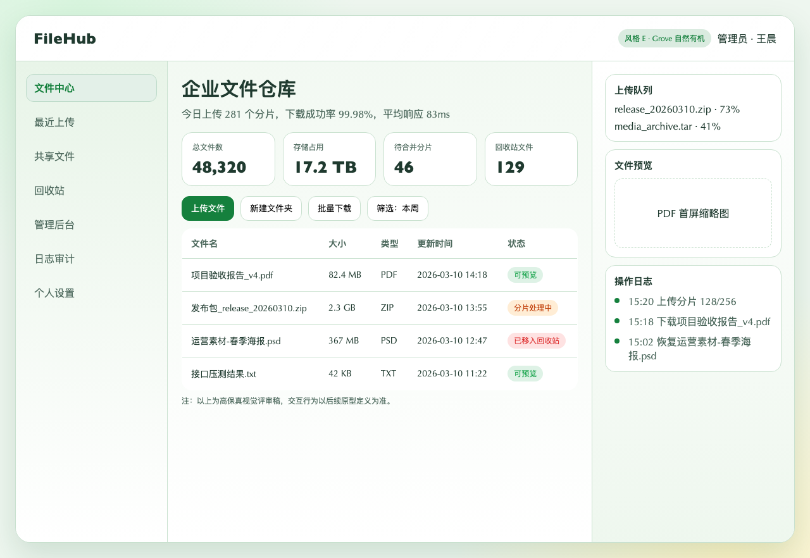

# FileHub 高保真 UI 方案（5 选 1）

统一页面集：文件中心 + 上传队列 + 文件预览 + 操作日志侧栏。  
目标：先确认视觉方向，再冻结设计令牌并进入开发。

## A. Aurora 玻璃渐变（推荐默认）

- 关键词：轻盈、现代、信任感
- 适用：企业后台 + 日常高频使用
- 特征：浅色渐变背景、玻璃质感容器、青橙强调色

## B. Carbon 商务深色

- 关键词：稳重、专业、夜间友好
- 适用：运维/审计/管理端长时工作
- 特征：深色面板、高对比数据卡、绿色主强调

## C. Editorial 杂志复古

- 关键词：内容感、品牌感、层次感
- 适用：强调文档与内容资产管理
- 特征：衬线字体、纸感底色、细边框结构

## D. Neon 科技网格

- 关键词：科技、监控、实时态
- 适用：实时运营看板或技术团队场景
- 特征：青红霓虹对比、网格化层次、暗背景

## E. Grove 自然有机

- 关键词：柔和、克制、长期可读
- 适用：偏文档与协作，追求视觉舒适
- 特征：绿色体系、圆角卡片、温暖辅助色

## 交付说明

- 原型文件：`docs/ui-prototypes/filehub-ui-preview.html`
- 预览图目录：`docs/ui-previews/`
- 待你选定最终方案后，将输出：
  - 设计令牌（颜色/字号/圆角/阴影）
  - PrimeVue 组件映射规范
  - 页面级实现清单（进入 P2/P3）

