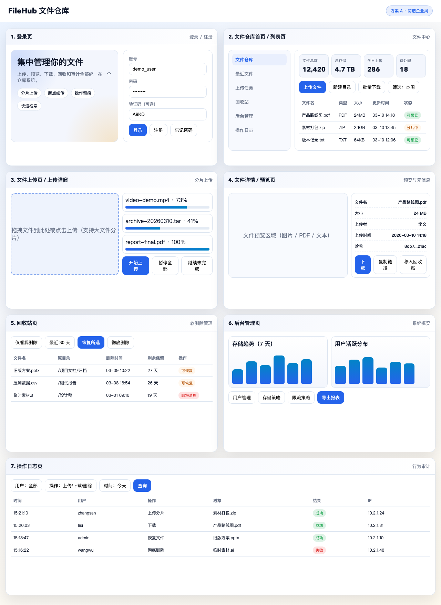
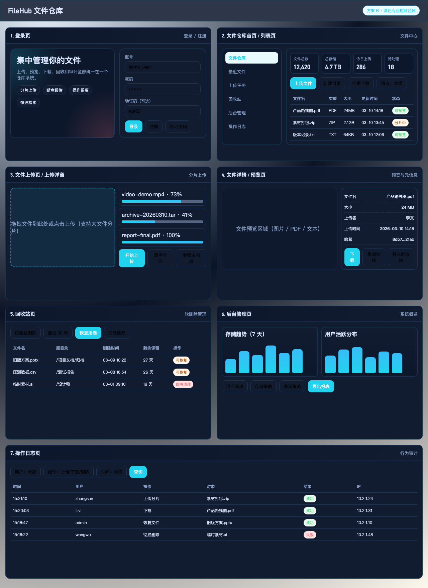
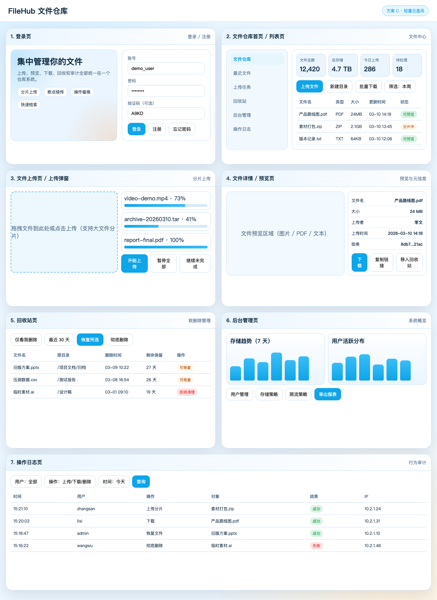
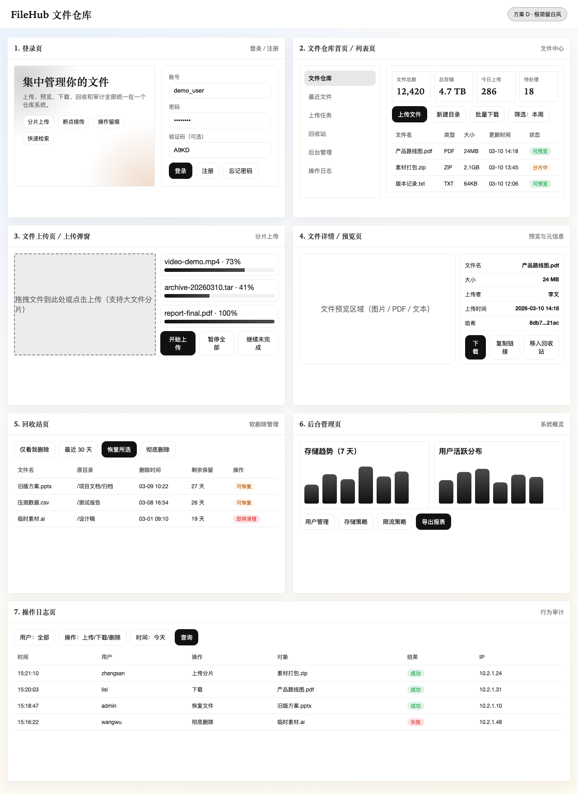
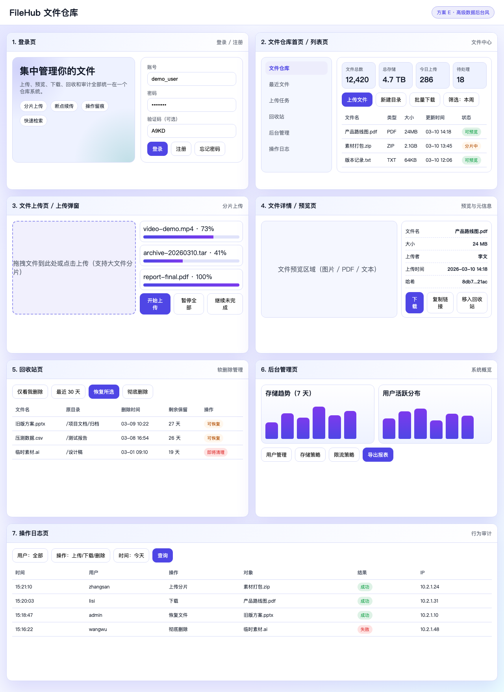

# FileHub UI 高保真方案（V2）

> 目标定位已调整为“文件仓库系统”（非企业协同平台）。

## Figma 工具使用说明（按你的要求）

- 已优先调用 Figma MCP：`whoami`、`generate_figma_design`。
- 当前 Figma 生成通道在本环境下为“网页捕获到 Figma”模式，不是“文本直接生成多套视觉稿”模式。
- 因此本轮先交付 5 套可直接评审的高保真视觉稿（含预览图 + 完整设计说明），你选定后我再按选中方案继续走 Figma 文件沉淀。

---

## 方案 A：简洁企业风（克制蓝）

1. 方案名称
- 简洁企业风（克制蓝）

2. 风格关键词
- 清晰、可信、稳健、易上手

3. 颜色体系
- 主色：`#2563EB`
- 辅色：`#0284C7`
- 强调色：`#F59E0B`
- 背景：`#F5F7FB`
- 卡片：`#FFFFFF`
- 边框：`#DBE4F0`
- 文本：`#0F172A`
- 次级文本：`#667085`

4. 字体与排版建议
- 标题：Avenir Next / PingFang SC，600-700
- 正文：PingFang SC，400-500
- 排版：8pt 间距体系；主标题 28、区块标题 16、正文 14、辅助 12

5. 页面布局说明（7 页）
- 登录页：左侧价值说明 + 右侧登录卡片。
- 文件列表页：左侧导航 + 顶部工具条 + 文件表格。
- 上传页：左拖拽区 + 右上传队列与分片进度。
- 预览页：左预览区 + 右元信息与操作按钮。
- 回收站页：顶部筛选 + 文件表格 + 恢复/彻底删除。
- 后台管理页：双图表 + 快捷管理入口。
- 操作日志页：筛选条 + 审计表格。

6. 关键组件设计说明
- 上传进度条：分片进度 + 状态标签（上传中/已完成/失败重试）。
- 文件状态标签：可预览、分片中、已删除。
- 日志筛选器：按用户/操作类型/时间组合查询。

7. 适用人群
- 首次上线、希望“低学习成本”的团队。

8. 优缺点
- 优点：通用性强、风险低、开发还原成本最低。
- 缺点：品牌辨识度一般，视觉冲击力较弱。

9. 预览图
- 

---

## 方案 B：深色专业控制台风（技术监控）

1. 方案名称
- 深色专业控制台风（技术监控）

2. 风格关键词
- 专业、专注、高密度、夜间友好

3. 颜色体系
- 主色：`#22D3EE`
- 辅色：`#38BDF8`
- 强调色：`#FB7185`
- 背景：`#0B1324`
- 卡片：`#111C31`
- 边框：`#1E3358`
- 文本：`#DCE7FF`
- 次级文本：`#8CA1C8`

4. 字体与排版建议
- 标题：DIN Alternate / PingFang SC，600
- 正文：IBM Plex Sans / PingFang SC，400-500
- 排版：信息密度略高；标题 26、模块标题 15、正文 13

5. 页面布局说明（7 页）
- 登录页：深色渐变背景，卡片式登录。
- 文件列表页：控制台布局，强调状态与吞吐数据。
- 上传页：进度队列高对比，适合观察大文件传输状态。
- 预览页：深色阅读模式，右侧固定元数据。
- 回收站页：风险操作（彻底删除）采用红色警示。
- 后台管理页：监控图表主导。
- 操作日志页：高对比审计列表，便于长时间排障。

6. 关键组件设计说明
- 监控卡片：上传速度、失败率、重试次数。
- 风险操作按钮：危险动作需二次确认。
- 图表卡片：存储趋势、活跃用户、错误率。

7. 适用人群
- 运维、管理员、技术团队高频使用场景。

8. 优缺点
- 优点：专业感强，数据可视化表现好。
- 缺点：普通用户首次使用门槛略高。

9. 预览图
- 

---

## 方案 C：轻量云盘风（清爽蓝）

1. 方案名称
- 轻量云盘风（清爽蓝）

2. 风格关键词
- 轻快、亲和、便捷、日常化

3. 颜色体系
- 主色：`#0EA5E9`
- 辅色：`#38BDF8`
- 强调色：`#FB923C`
- 背景：`#EDF7FF`
- 卡片：`#FFFFFF`
- 边框：`#C9E2F5`
- 文本：`#0F2940`
- 次级文本：`#56718C`

4. 字体与排版建议
- 标题/正文：Nunito + PingFang SC
- 排版：圆角更大（18），强调可点击与轻量感

5. 页面布局说明（7 页）
- 登录页：轻视觉宣传区，注册入口明显。
- 文件列表页：清爽表格 + 快速上传入口。
- 上传页：大面积拖拽区，主打“拖进来就上传”。
- 预览页：预览区更大，适合阅读内容。
- 回收站页：恢复动作优先。
- 后台管理页：以概览卡片 + 简图表呈现。
- 操作日志页：弱化压迫感，偏运营视角。

6. 关键组件设计说明
- 上传入口组件：拖拽 + 点击上传双模式。
- 快捷过滤：最近上传、最近下载、我创建的。
- 轻量状态提示：减少重警示，强调操作流畅。

7. 适用人群
- 中小团队、对体验友好度要求高的场景。

8. 优缺点
- 优点：亲和力高、学习成本低。
- 缺点：审计与管控的“严肃感”较弱。

9. 预览图
- 

---

## 方案 D：极简留白风（内容优先）

1. 方案名称
- 极简留白风（内容优先）

2. 风格关键词
- 克制、安静、留白、文档导向

3. 颜色体系
- 主色：`#111111`
- 辅色：`#4B4B4B`
- 强调色：`#B45309`
- 背景：`#FAFAFA`
- 卡片：`#FFFFFF`
- 边框：`#ECECEC`
- 文本：`#111111`
- 次级文本：`#686868`

4. 字体与排版建议
- 标题：Iowan Old Style / Songti SC
- 正文：Helvetica Neue / PingFang SC
- 排版：更大留白，分隔线替代重色块

5. 页面布局说明（7 页）
- 登录页：纯表单 + 轻提示。
- 文件列表页：黑白灰为主，强调文件本身信息。
- 上传页：极简拖拽区 + 低干扰进度。
- 预览页：大预览区，元信息极简对齐。
- 回收站页：操作按钮简洁，避免视觉噪声。
- 后台管理页：简图与文字指标。
- 操作日志页：审计表格优先可读性。

6. 关键组件设计说明
- 线性按钮体系：主次按钮仅靠线条与填充区分。
- 内容导向表格：减少背景色，突出行间秩序。
- 极简提醒：仅关键错误使用强调色。

7. 适用人群
- 重内容、重文档、偏管理流程稳定的团队。

8. 优缺点
- 优点：长期使用不疲劳，文本阅读舒适。
- 缺点：视觉记忆点较弱，年轻化不足。

9. 预览图
- 

---

## 方案 E：高级数据后台风（数据主导）

1. 方案名称
- 高级数据后台风（数据主导）

2. 风格关键词
- 数据、洞察、决策、效率

3. 颜色体系
- 主色：`#4F46E5`
- 辅色：`#7C3AED`
- 强调色：`#0D9488`
- 背景：`#F4F6FF`
- 卡片：`#FFFFFF`
- 边框：`#D6DAF8`
- 文本：`#111827`
- 次级文本：`#5B6270`

4. 字体与排版建议
- 标题：SF Pro Display / PingFang SC
- 正文：Inter / PingFang SC
- 排版：数据模块优先，标题层级明确

5. 页面布局说明（7 页）
- 登录页：偏管理后台风，强调系统入口。
- 文件列表页：顶部指标 + 表格并重。
- 上传页：上传进度与吞吐指标并列。
- 预览页：右侧补充数据维度（哈希、来源、下载统计）。
- 回收站页：保留周期可视化。
- 后台管理页：多图表矩阵 + 快速运营动作。
- 操作日志页：分析型筛选 + 结果列表。

6. 关键组件设计说明
- KPI 卡片：文件规模、存储占比、成功率、失败率。
- 趋势图模块：上传量趋势、用户活跃趋势。
- 审计透视：日志按类型聚合并支持 drill-down。

7. 适用人群
- 管理员占比高、重视数据与可观测性的团队。

8. 优缺点
- 优点：管理效率高，后续扩展 BI 能力顺滑。
- 缺点：视觉密度较高，普通用户页面需减负。

9. 预览图
- 

---

## 建议选型（结合“只是文件仓库”）

- 推荐优先：A（简洁企业风）或 C（轻量云盘风）。
- 原因：两者更贴近“文件仓库”而非“重管控企业平台”，并且后续实现与维护成本更可控。

## 设计资产位置

- 设计板原型：`docs/ui-prototypes/filehub-ui-preview-v2.html`
- 预览图：`docs/ui-previews/v2-style-*.png`
